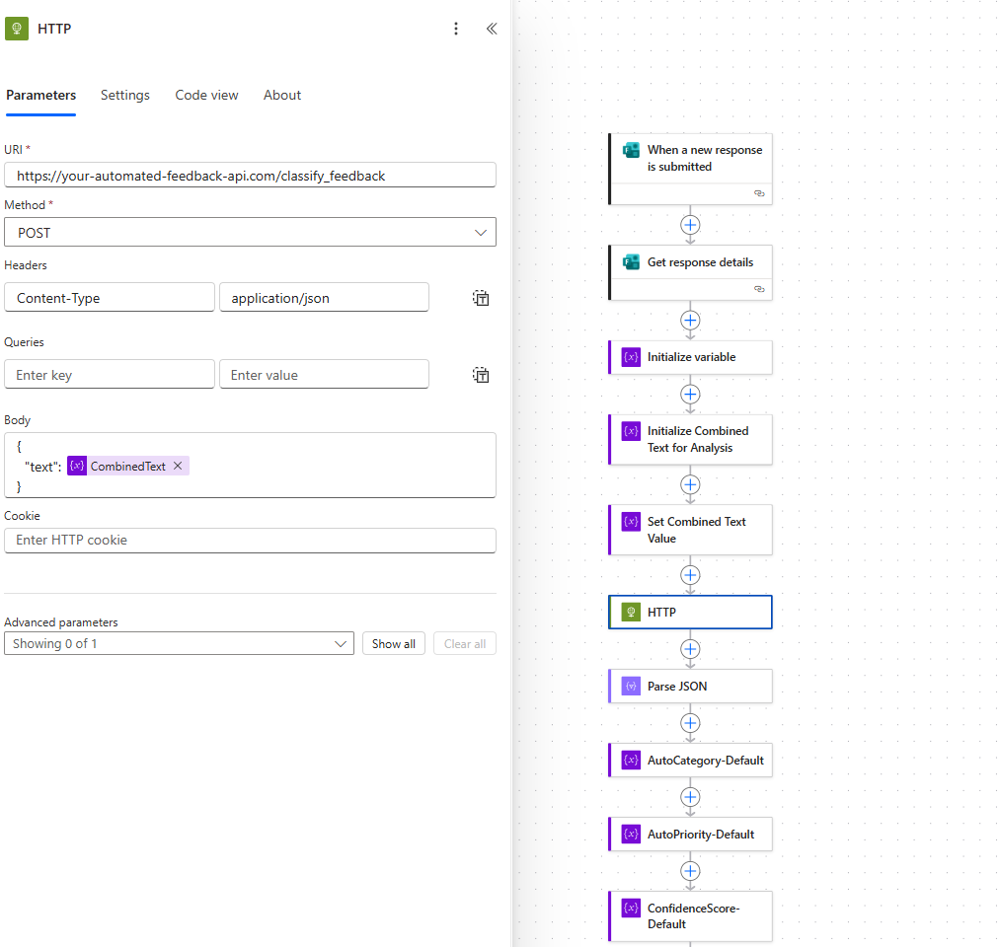
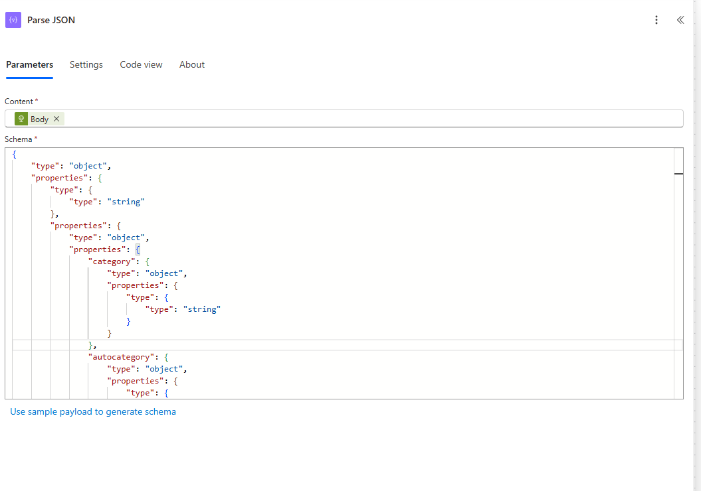
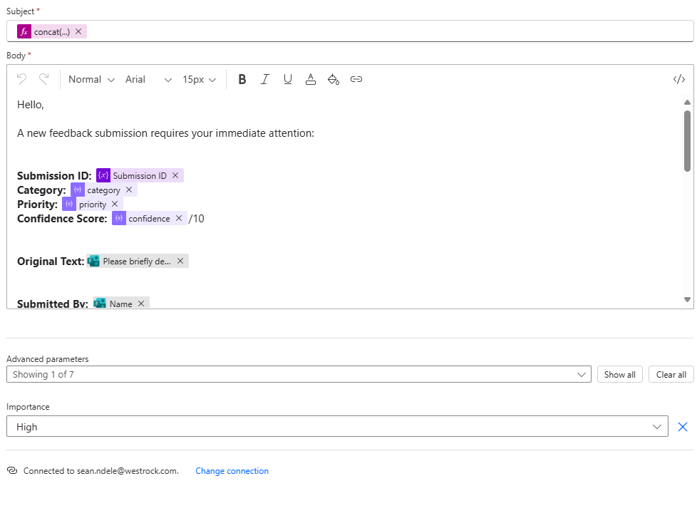
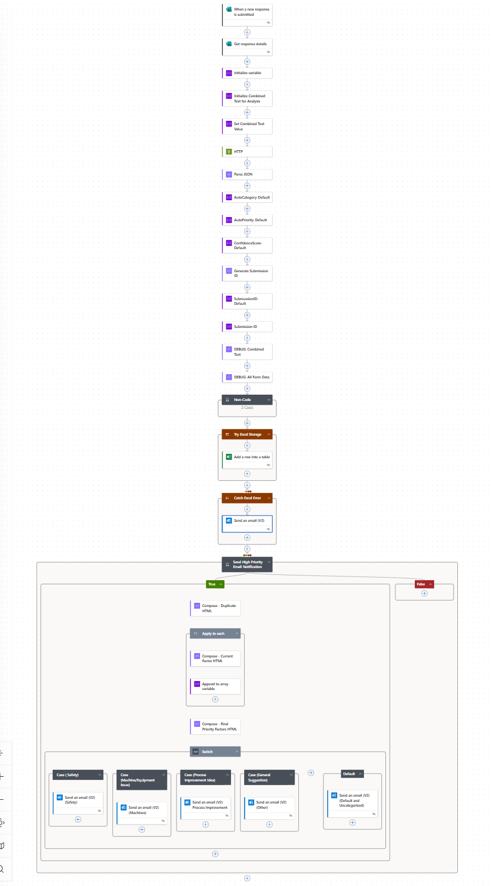

# Automated Factory Feedback Processing Flow

This Power Automate cloud flow automates the entire lifecycle of factory floor feedback, from submission and intelligent classification by a Flask backend to dynamic Excel logging and real-time email notifications. It ensures critical insights are rapidly processed and routed to the right stakeholders.

---

## Trigger ⚡

This flow is automatically triggered **when a new response is submitted to the 'Factory Feedback Form' (Microsoft Forms)**. This ensures that every new piece of feedback immediately enters the automated pipeline.

* **Trigger Service**: Microsoft Forms
* **Form Name**: 'Factory Feedback Form'

---

## Flow Logic & Key Steps ⚙️

The flow is designed to seamlessly process feedback through several stages:

### 3.1. Retrieve Form Data

Upon submission, the flow retrieves all fields from the 'Factory Feedback Form' response.

### 3.2. Classify & Prioritize Feedback (HTTP to Flask Backend)

The raw feedback data is sent as a JSON payload to a custom-deployed Python Flask API. This API performs the intelligent classification and prioritization based on predefined rules and keyword matching.

* **Action**: HTTP
* **Method**: POST
* **URI**: `[Your Deployed Flask App URL]/classify_feedback` (e.g., `https://your-flask-app.azurewebsites.net/classify_feedback`)
* **Headers**: `Content-Type: application/json`
* **Body**: Form data is mapped to JSON keys expected by the Flask API (e.g., `Name`, `BriefDescription`, `ImpactLevel`).

### 3.3. Parse Flask Response

The JSON response from the Flask API (containing `FeedbackCategory`, `autopriority`, `submission_id`, etc.) is parsed to extract key analytical fields.

* **Action**: Parse JSON
* **Content**: Body from the previous HTTP action.
* **Schema**: Dynamically generated from the expected Flask API response structure.

### 3.4. Log Feedback to Excel Master Data

The processed and enriched feedback data is then added as a new row to the `Raw_Data` sheet (which is an Excel Table named `FeedbackLog`) in the `Feedback_Data_Master.xlsx` workbook.

* **Action**: Excel Online (Business) - Add a row into a table
* **Workbook**: `Feedback_Data_Master.xlsx`
* **Table**: `FeedbackLog`
* **Column Mapping**: Fields from Parse JSON are mapped to corresponding Excel columns.

### 3.5. Dynamic Email Notifications 📧

Based on the `autopriority` determined by the Flask app, the system sends targeted email alerts to relevant teams.

* **Action**: Condition
* **Condition**: `autopriority` is equal to 'Critical'
    * **If Yes (Critical Alert)**:
        * **Action**: Send an email (V2) - Office 365 Outlook
        * **To**: Specific recipient(s) (e.g., Plant Manager, Safety Lead)
        * **Subject**: `@concat('CRITICAL FEEDBACK ALERT: ', body('Parse_JSON')?['FeedbackCategory'], ' - ', body('Parse_JSON')?['BriefDescription'])`
        * **Body**: Detailed message including all feedback fields.
        * **CC**: Configured for additional stakeholders.

* **Nested Conditions**: Similar conditions are set for 'High' and 'Medium' priorities, potentially with different recipients or subject prefixes.

### 3.6. Overall Flow Structure Visual

Below is a high-level overview of the Power Automate flow, illustrating its main branches and actions.

